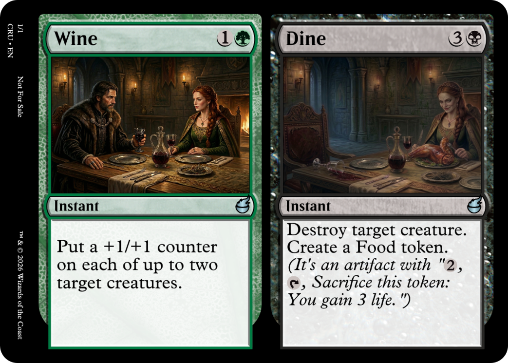

#  MTG Crucible

A TypeScript library for rendering custom Magic: The Gathering card images as PNGs.

Includes a react component for rendering resulting card images, complete with card rotations for double-faced cards, etc.

## Installation

```bash
npm install mtg-crucible
```

## Quick Start

### From text

```typescript
import { renderCard } from 'mtg-crucible';
import { writeFileSync } from 'fs';

const result = await renderCard(`
Crucible of Legends {3}
Legendary Artifact
Whenever a legendary creature you control dies, return it to your hand at the beginning of your next upkeep.
Flavor Text: Every great story begins with fire.
Rarity: Mythic Rare
Art URL: https://raw.githubusercontent.com/domainellipticlanguage/mtg-crucible/refs/heads/main/examples/crucible-art.png
`);

writeFileSync('crucible-of-legends.png', result.frontFace);
```

### From structured data

```typescript
import { renderCard } from 'mtg-crucible';

const result = await renderCard({
  name: 'Crucible of Legends',
  manaCost: '{3}',
  typeLine: 'Legendary Artifact',
  abilities: 'Whenever a legendary creature you control dies, return it to your hand at the beginning of your next upkeep.',
  flavorText: 'Every great story begins with fire.',
  rarity: 'mythic',
  artUrl: 'https://raw.githubusercontent.com/domainellipticlanguage/mtg-crucible/refs/heads/main/examples/crucible-art.png',
});

writeFileSync('crucible-of-legends.png', result.frontFace);
```


## Supported Templates

- Standard (including colorless/Eldrazi full-bleed art)
- Planeswalker (3 and 4 ability variants)
- Saga
- Class
- Battle
- Adventure
- Transform (front and back)
- MDFC / Modal DFC (front and back)
- Split
- Fuse
- Flip (Kamigawa-style)
- Aftermath
- Mutate
- Prototype
- Leveler

Also supports Snow, Devoid, and Nyx borders, although currently only for Standard cards.

## API

### `renderCard(input: CardData | string, options?: RenderOptions): Promise<RenderedCard>`

Parse and render a card. Accepts either a text-format string or a `CardData` object. Returns a `RenderedCard` with `frontFace` (image buffer), optional `backFace`, orientation info, and rotation data for multi-face cards.

Options:
- `quality` — `'high'` (2010x2814, default), `'medium'` (745x1040), or `'low'` (350x490)
- `format` — `'png'` (default, lossless with transparency), `'jpeg'` (smaller, no transparency, white corners), or `'webp'` (smallest, with transparency)
- `allowUnsafeArtUrls` — defaults to `false`. See [Security](#security) below.

#### Output sizes

Front-face buffer size for a typical card with art (Archangel Avacyn):

| quality | png | jpeg | webp |
|---------|-----|------|------|
| low (350×490) | 308 KB | 72 KB | 28 KB |
| medium (745×1040) | 1167 KB | 233 KB | 86 KB |
| high (2010×2814) | 5529 KB | 1013 KB | 355 KB |

For a card with no fetched art (Lightning Bolt):

| quality | png | jpeg | webp |
|---------|-----|------|------|
| low | 154 KB | 42 KB | 13 KB |
| medium | 570 KB | 137 KB | 41 KB |
| high | 2818 KB | 599 KB | 188 KB |

WebP uses lossy quality 60/70/80 for low/medium/high. Generate fresh numbers with `npx tsx scripts/sizes.ts`.

### `parseCard(text: string): CardData`

Parse a text-format card definition into a `CardData` object.

### `formatCard(card: CardData): string`

Convert a `CardData` object back to text format (round-trips with `parseCard`).

### `normalizeCard(card: CardData): NormalizedCardData`

Normalize a `CardData` into `NormalizedCardData` with all fields resolved (frame colors derived, abilities parsed, defaults filled in).

### `getArtDimensions(card: CardData): { primaryArtDimensions: { width, height }; secondaryArtDimensions?: { width, height } }`

Get the expected art image dimensions for a card. Returns primary dimensions, and secondary dimensions if the card has a linked card (e.g. transform, split, aftermath).

## Text Format

For convenience, cards can be defined in a plain text format, which is a superset of Scryfall's copy-pasteable text format. 

Additional metadata fields can appear on any line (order doesn't matter):

- `Rarity: Mythic Rare`
- `Flavor Text: Every great story begins with fire.`
- `Art URL: https://example.com/art.png`
- `Art Description: A fiery landscape`
- `Artist: Chris Rahn`
- `Set: MH3`
- `Collector Number: 205`
- `Designer: Mark Rosewater`
- `Frame Color: Red and Blue`
- `Frame Effect: Nyx`
- `Accent Color: Green`
- `Name Line Color: Blue and Red`
- `Type Line Color: White`
- `PT Box Color: Black`

These fields can be used to create flavorful card styles. For example:

### Combine Snow and Nyx borders
```
Conduit of Fire and Ice {2}{U/R}
Artifact
Whenever you cast an instant or sorcery spell, choose one —
- Fire — Conduit of Fire and Ice deals 1 damage to each opponent.
- Ice — Scry 1.
Art URL: https://raw.githubusercontent.com/domainellipticlanguage/mtg-crucible/refs/heads/main/examples/conduit-art.png
Frame Effect: Nyx, Snow
Frame Color: Red, Blue
```


### Multi-color border
```
The Candy Striper {2}{R}{W}
Legendary Creature — Nightmare Spirit
Haste, lifelink
Whenever the Candy Striper attacks, each opponent loses 1 life and you gain 1 life for each enchantment you control.
3/3
Art URL: https://raw.githubusercontent.com/domainellipticlanguage/mtg-crucible/refs/heads/main/examples/candy-striper-art.png
Frame Color: Red, White, Red, White, Red, White, Red, and White
Accent: Red, White, Red, White, Red, White, Red, and White
Name Line Color: Red, White, Red, White, Red, White, Red, and White
Type Line Color: Red, White, Red, White, Red, White, Red, and White
PT Box Color: Red, White, Red, White, Red, White, Red, and White
```


### Composite cards
To define a composite card (split, modal double-faced, etc.) use the `----` separator between card parts.

```
Wine {1}{G}
Instant
Put a +1/+1 counter on each of up to two target creatures.
Art URL: https://raw.githubusercontent.com/domainellipticlanguage/mtg-crucible/refs/heads/main/examples/wine-art.png
Rarity: Uncommon
----
Dine {3}{B}
Instant
Destroy target creature. Create a Food token. (It's an artifact with "{2}, {T}, Sacrifice this token: You gain 3 life.")
Art URL: https://raw.githubusercontent.com/domainellipticlanguage/mtg-crucible/refs/heads/main/examples/dine-art.png
```



Crucible will infer the link type from the card parts, but if you want to be explicit, you can use the link type in the card definition:

Instead of `----`, you can use one of `--transform--`, `--mdfc--`, `--split--`, `--fuse--`, `--flip--`, `--adventure--`, or `--aftermath--`.

## React Component
Crucible provides a React component for rendering cards.

```tsx
import { MtgCard } from 'mtg-crucible/react';

<MtgCard
  card={renderedCardDisplay}
  cardText="Crucible of Legends"           // will be invisible, but searchable with ctrl+f
  rotateWidgetStyle={{ display: 'none' }}  // optional: hide rotation arrow
/>
```

The component supports:
- Rotations for non-standard cards (battles, flip, aftermath, etc.)
- Right-click context menu: download, copy image, copy text formats
- Invisible searchable text overlay for Ctrl+F


## Development

```bash
npm test          # run tests (vitest)
npm run build     # compile TypeScript
npm run dev       # start local dev server with hot reload
```

## TODO
- [ ] Fix Snow not automatically getting Snow frame effect
- [ ] Fix Enchantment creatures/artifacts, etc. not automatically getting Nyx frame effect
- [ ] Fix bug where getArtDimensions does not normalize first
- [ ] Fix bug when inferring ability word vs. ability keyword with duplicated ability
- [ ] Support d20 rows
- [ ] Fix Fuse
- [ ] Support Rooms
- [ ] Support Omen
- [ ] Support Station
- [ ] Support all frame effects (Snow, Nyx, Devoid) for all card types
- [ ] Support MDFC/Transform for all card types
- [ ] Support composite artist credits
- [ ] Support custom set symbol image via `setSymbolUrl`
- [ ] Optimize asset size
- [ ] Refactor colorless as a frame effect
- [ ] Refactor planeswalker as a frame effect
- [ ] Refactor exclusion zone architecture
- [ ] Fix exclusion zone on P/T box
- [ ] Fix border radius on component
- [X] When rendering jpeg, fill in round corners with white
- [X] Render double quotes as smart quotes
- [X] Render artist credit in small caps
- [ ] Fix various rendering bugs around exclusion zones (P/T, Planeswalker loyalty, etc.)
- [ ] Fix split card text sizing
- [ ] Additional bleed zone
- [ ] Download for DFC should be concatenated images
- [X] Support buffer for art
- [ ] Rename artUrl to just art
- [ ] Improve masking for split cards (mask area invalid).
- [X] Elongate hyphen for keyword abilities (`Equip - {2}`) and modals (`Choose one -`).
- [X] Add hybrid colorless
- [ ] Use a mask for multi-colored rooms
- [X] Standardize layout convention (x,y,angle)

### Rendering bugs
- [ ] Fix spacing on Omen name line (too much room between name and mana cost)
- [ ] Not rendering flavortext on flip secondary
- [ ] color indicator on flip renders on wrong side
- [ ] Fix tab alignment for modal (cryptic command)
- [ ] Art Description: multi-line like Flavor Text:

Missing color indictor, also bug with flip cards where if no P/T, the set symbol still respects the P/T exclusion zone
```
Cinderforge Goblet {2}{R}
Artifact
Whenever you cast an instant or sorcery spell, Cinderforge Goblet deals 1 damage to any target.
If a player would be dealt damage by Cinderforge Goblet, instead flip it.
Rarity: Uncommon
Flavor Text: The molten brew never stays still.
Art Description: A fiery goblet erupting with flames
Artist: prunaai/p-image
Designer: thismagiccarddoesnotexist.com
----
Cinderforge Dragon
Color Indicator: Red
Creature — Dragon
Flying
Whenever Cinderforge Dragon deals combat damage to a player, that player discards a card.
4/4
Rarity: Uncommon
Flavor Text: Its roar reshapes the battlefield.
Art Description: A massive red dragon coiled around a forge
Artist: prunaai/p-image
Designer: thismagiccarddoesnotexist.com
```


Messed up reminder hint on primary face:
```
Kami's Blade {3}{W}{U}
Creature — Spirit Soldier
First strike
Whenever Kami's Blade attacks, you may exile target instant or sorcery card from your graveyard. If you do, Kami's Blade gets +1/+1 until end of turn.
2/3
Rarity: Rare
Flavor Text: The blade sings with the voices of ancestors, guiding each strike toward destiny.
Art Description: An ethereal samurai in shimmering armor wields a glowing katana; cherry blossoms drift around him under a moonlit sky.
Artist: prunaai/p-image
Designer: thismagiccarddoesnotexist.com
----
Kami's Edge
Color Indicator: White and Blue
Artifact — Equipment
Equipped creature gets +2/+2 and has vigilance.
Whenever equipped creature deals combat damage to a player, you may sacrifice Kami's Edge. If you do, create a 2/2 white Spirit creature token.
Rarity: Rare
Art Description: The same katana, now a radiant relic hung on a shrine wall, its edge shimmering with lingering spiritual energy.
Artist: prunaai/p-image
Designer: thismagiccarddoesnotexist.com
```

Weirdly small type line on primary card:
```
Mirage Trickster {2}{U}
Creature — Illusion
Whenever Mirage Trickster deals combat damage to a player, flip Mirage Trickster.
2/2
Rarity: Uncommon
Flavor Text: Its form shimmers, never quite where you think.
Art Description: ...
Artist: prunaai/p-image
Designer: thismagiccarddoesnotexist.com
----
Illusory Apex
Color Indicator: Blue
Creature — Illusion
Flying
Whenever Illusory Apex deals combat damage to a player, you may return target nonland permanent to its owner's hand.
4/4
Rarity: Uncommon
Flavor Text: Reality bends to its will, leaving only wonder behind.
Artist: prunaai/p-image
Designer: thismagiccarddoesnotexist.com
```
## Security

When rendering card data from untrusted users (e.g. on a public web server), leave `allowUnsafeArtUrls` off (the default). This blocks art URLs that point to:

- Local files (`/path`, `./path`, `file://`)
- Loopback addresses (`127.0.0.1`, `localhost`)
- Private network ranges (`10.0.0.0/8`, `172.16.0.0/12`, `192.168.0.0/16`)
- Link-local addresses (`169.254.0.0/16`, including cloud metadata services like `169.254.169.254`)

Safe to enable in single-user, CLI, or build-script contexts where the card data comes from you, not from untrusted users.

Public URLs like `https://i.imgur.com/abc.png` always work fine — only "local" or "internal" URLs are affected by `allowUnsafeArtUrls`. This prevents [SSRF](https://owasp.org/www-community/attacks/Server_Side_Request_Forgery) and local file disclosure attacks.

Note: protection is best-effort. There is a small DNS-rebinding race window between hostname resolution and connection. For stronger guarantees, enforce egress rules at the network level.

## Acknowledgements

Card frame assets are derived from [Card Conjurer](https://github.com/Investigamer/cardconjurer), an open-source MTG card creation tool.

Magic: The Gathering is a trademark of Wizards of the Coast, LLC. This project is not affiliated with, endorsed by, or sponsored by Wizards of the Coast or Hasbro.
