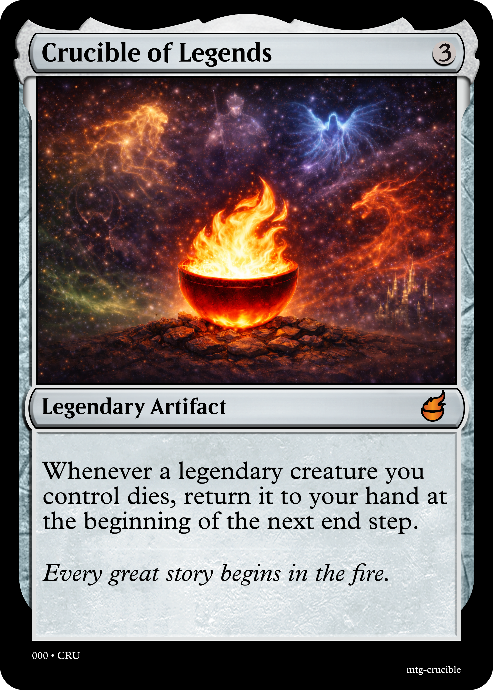

# mtg-crucible

A TypeScript library for rendering Magic: The Gathering card images as PNGs.

## Installation

```bash
npm install mtg-crucible
```

## Quick Start

```typescript
import { renderFromText } from 'mtg-crucible';
import { writeFileSync } from 'fs';

const png = await renderFromText(`
  Crucible of Legends {3}
  Art: https://raw.githubusercontent.com/nathanfdunn/mtg-crucible/refs/heads/main/logo/banner-image.png
  Rarity: Mythic Rare
  Legendary Artifact
  Whenever a legendary creature you control dies, return it to your hand at the beginning of the next end step.
  *Every great story begins with fire.*
`);

writeFileSync('crucible-of-legends.png', png);
```



## API

### `renderFromText(text: string): Promise<Buffer>`

Parse a text-format card definition and render it to a PNG buffer in one step.

### `parseCard(text: string): CardInput`

Parse a text-format card definition into a `CardInput` object. Useful when you want to inspect or modify the parsed data before rendering.

### `renderCard(card: CardInput): Promise<Buffer>`

Render a `CardInput` object to a PNG buffer. Automatically dispatches to the correct renderer based on the card type (standard, planeswalker, saga, or battle).

### Individual renderers

For direct control, each renderer is also exported:

- `renderStandard(card: CardData): Promise<Buffer>`
- `renderPlaneswalker(card: PlaneswalkerData): Promise<Buffer>`
- `renderSaga(card: SagaData): Promise<Buffer>`
- `renderBattle(card: BattleData): Promise<Buffer>`

## Text Format

Cards are defined in a plain text format inspired by official text spoilers.
For the full grammar, metadata reference, and corner cases, see [docs/text-format.md](docs/text-format.md).

### Standard cards

```
Name {mana cost}
Art: <art url> (Optional)
Rarity: <rarity> (Optional)
Type Line
Rules text line 1
Rules text line 2
Power/Toughness
*Flavor text*
```

Each line of rules text becomes a separate paragraph on the rendered card. Mana symbols use curly brace notation: `{W}`, `{U}`, `{B}`, `{R}`, `{G}`, `{C}`, `{T}`, `{1}`, `{2}`, etc. Hybrid and phyrexian mana are supported: `{G/U}`, `{G/P}`.

Power/toughness is only parsed for creatures and vehicles. Wildcards like `*/1+*` are supported.

Flavor text is wrapped in `*asterisks*` and must come after P/T (at the very end). Multiple flavor lines are joined with newlines:

```
Wrath of God {2}{W}{W}
Sorcery
Destroy all creatures. They can't be regenerated.
*Legend speaks of the Creators' rage at their most prized creation.*
```

Reminder text `(like this)` in the middle of rules text is preserved as rules text, not treated as flavor.

### Extended Text Spoiler Format

An art image URL can be specified between the name and type line, amont other things

```
Archangel Avacyn {3}{W}{W}
Art: https://cards.scryfall.io/art_crop/front/7/f/7f4893ef.jpg
Rarity: Rare
Legendary Creature — Angel
Flash
Flying, vigilance
4/4
*Some flavor text*
```

### Planeswalkers

```
Liliana of the Veil {1}{B}{B}
Legendary Planeswalker — Liliana
+1: Each player discards a card.
-2: Target player sacrifices a creature.
-6: Separate all permanents target player controls into two piles.
Loyalty: 3
```

Abilities prefixed with `+N:`, `-N:`, or `0:` are parsed as loyalty abilities. Lines without a cost prefix are treated as static abilities.

### Sagas

```
The Eldest Reborn {4}{B}
Enchantment — Saga
I — Each opponent sacrifices a creature or planeswalker.
II — Each opponent discards a card.
III — Put target creature or planeswalker card from a graveyard onto the battlefield under your control.
```

Chapter numerals (I through VI) are parsed automatically. Combined chapters are supported:

```
I, II — Create a 1/1 red Goblin creature token.
III — Creatures you control get +2/+0 until end of turn.
```

### Battles

```
Invasion of Gobakhan {1}{W}
Battle — Siege
When Invasion of Gobakhan enters the battlefield, look at target opponent's hand.
Defense: 3
```

### Lands (no mana cost)

```
Command Tower
Land
{T}: Add one mana of any color in your commander's color identity.
```

## Frame Color

The frame color is automatically derived:

| Condition | Frame |
|---|---|
| Type includes "Vehicle" | `v` (vehicle) |
| Type includes "Land" + no mana cost | `l` (land) |
| No colored mana symbols | `a` (artifact/colorless) |
| One color in mana cost | That color (`w`, `u`, `b`, `r`, `g`) |
| Two or more colors | `m` (multicolor/gold) |

Colors are extracted from all mana symbols including hybrid (`{G/U}`) and phyrexian (`{G/P}`).

## Card Dimensions

| Card Type | Width | Height |
|---|---|---|
| Standard | 2010 | 2814 |
| Planeswalker | 1500 | 2100 |
| Saga | 1500 | 2100 |
| Battle | 2814 | 2010 (landscape) |

## Development

```bash
npm test          # run tests (vitest)
npm run build     # compile TypeScript
npm run spike     # render test cards to output/
```


## TODO

- Improve set symbol generation with logo
- Fix missing rarity on sagas
- Test limits of parser leniency
- Test reminder text without asterisks
- Test multiple lines of flavor text
- Investigate card dimensions
- [X] Add blurb about Extended Text Spoiler format
- Update readme examples to be custom
- Add a carddata example to quickstart
- Add Class enchantment to spike
- Support Level Up https://scryfall.com/card/c13/43/echo-mage
    - note how this affect P/T assumptions...
- Support more hybrid mana
    - Phyrexian hybrid
    - colorless/color hybrid
    - 2/color hybrid
- Support multi-cards
    - Enchantment Rooms
        - https://scryfall.com/card/dsk/43/bottomless-pool-locker-room
    - Fuse cards
    - Adventures
    - MDFC
    - Kamigawa flip cards
    - Flip cards (Werewolf, etc.)
- Support Varying P/T
    - Leveler Cards
    - Prototype
- Support Mutate
- Test harness
- Optimize asset size
    - Downsample everything - it's excessive right now
        - 744 × 1039 and jpeg to match mtg.design
        - 672 × 936 to match scryfall
    - Alternatively, procedurally generate textures + frames
    - Can we get away with a single frame/format to serve Class, Saga, Case?
    - Think we just need an AccentColor enum
- Ponder if card template should be more coarse grained
- Finalize the schema
- Support color indicator
- Support saga creature
- Support the MDFC / Transform triangle indicator.
- Figure out what default set/sequence/collection should be
- Support {11} to {20}
- Support untap symbol {Q}
- Support two color accents & crowns - does CC have these?
    - does not look like it...perhaps can use them as masks applied to other renders
- Support the wedge for MDFC or transform cards

## Bugs
- Fix planeswalker ability spacing
    - Four ability planeswalkers seem to have a different template?
- Fix planeswalker templates to have transparency
    - pretty sure our current setup can handle this
- Revamp parser - Flavor Text: or Flavor:       X
- More lenient parsing - we can ...
- Fix planeswalker art render positioning   X
- Fix common set logo
- Fix colored artifacts using wrong border (do we support accents though?)
- Fix land accents - why is command tower gold?
    - Ok I think if it produces multiple colors, the accent changes. Colorless lands have no accent
    - This complicates our enums...
    - Archway of Innovation - example of other. Same with basics...
    - Oh and dryad arbor
- Reminder text does not get rendered in italics. (Anything in parens can be assumed to be reminder text)
- Legendary crown is missing a shadow on the side
- Asterisked text in flavor text should be normal faced, not italic
- Nit: Saga reminder text could be formatted a little better
- For gold and hybrid frames, still use the default for the name and typeline. Same for P/T box
- Lands have distinctive text box backgrounds?
- Make hybrid mana parsing more lenient - 
    - but normalize it to the correct order. Similar for phyrexian mana
- Update Flavortext parsing
- Multicolored artifact
- Urza's Saga - just straight up broken
- Shrewed Hatchling - P/T box wrong color
- Drayad Arbor - no P/T box. name and type box are wrong color

- An Unearthly Child - where does that little golden bit come from?
- Ability to override text size??

- Parsing - should the unstructured PW ability use the PW ability template with '' cost?

## Design Decisions
- should we support multicolored as an alias for gold?
- '' single letters as aliases?
- should normalize sort mana values?
- do we support styling in the text format? too complicated and people should just use the JSON format
- Should we infer missing hyphens in type line?
    - anything unrecognized is assumed to be a subtype?

# TODO
- test with LTS
- Add {S} symbol
- Should we expose the name and type line colors? Yeah might as well.

- Expose function to Derive the art boundaries.

## Future Features And Blockers
- Pass in FrameModifier / FrameVariant / FrameStyle
    - can be a list or single value. List will round robin??
- Support devoid borders
- Support nyx borders
- Support Snow borders

- Support various borders
- Support hybrid mana borders
- Support composite cards
    - mdfc is fine
    - transform - double the crowns?
    - flip - another 5 templates. no pinlines?
- Tokens?
- Flavor Name (nickname)


# bugs
Arni Slays the Troll - saga drawable areay is rectangle...

- fix reminder text italics

https://cran.r-project.org/web/packages/scryr/vignettes/frames.html
- Frame Effects

- Lesson

Only way to avoid combinatorial explosion - separate layers

## Supported
Battles (only the front face)

## Maybe
- Keyrune integration https://keyrune.andrewgioia.com/icons.html


# API's
```typescript
renderCard(cardData: CardData): RenderedCard

renderCard(text: string): RenderedCard

parseCard(text: string): CardData
formatCard(cardData: CardData): string

normalizeCard(cardData: CardData): CardData


// TODO maybe make a class and there should just be an aspectRatio property that does the division.
getArtDimensions(cardTemplate: CardTemplate): { widthPixels: number; heightPixels: number; aspectRatioWidth: number; aspectRatioHeight: number; }
```

# Plan
Note: IF you need to refer to any borders and assets, you cannot do that yet. they are downloading. But at some point you will be able to refer to Card Conjurer

1. [X] Fix everything to use the new apis and types. i.e. fix the build
1. [X (supposedly)] Harden the text parser
1. Create test framework whereby the AI can query scryfall for the text, json, art crop, and rendered card. Then we render our own card (using the scryfall art crop for art), then we concatenate our card with the scryfall card and the AI can view them side by side in a single image to allow for excruciating detail comparison.
1. Add support for composite cards. In the text format as well

# Decisions
Card normalization - do we help them out with boilerplate reminder text for sagas and classes?
Could we support hybrid borders via draw tools? linear gradient to shift between them?

# Tech Debt
- The Class level one is still messed up - tried changing it and it got messed up. I think we do need to parse it as level one?

# React Component
- Let's create a react component for displaying a RenderedCard object
- rotations - you can click likee on scryfall
- Card name rendered in an invisible span so that people can ctrl+F
- right click to copy scryfall text, copy crucible text, copy scryfall json, copy crucible json, copy card image (the face you are currently looking at)
- some way to control zoom/scale (maybe that's just regular styling and the component doesn't need to care?)
- This should be structured so that people can independently import the component or the parser or the renderer. The react component will have a peer dependency on react.

devoid cards are full art

Remove support for asterisk-bounded flavor text

Normal form - I guess we should use caps for everything? titel case? Avoid conversions...


Normal form - abilities should be converted to an array?
    - should have a Null StructuredAbilities new type of Parsed
    